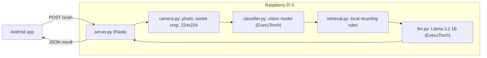

# VERDE Architecture

VERDE (Verified Edge Recycling Decision Engine) is a smart recycling assistant. A Raspberry Pi 5 with a camera identifies a waste item and tells the user how to dispose of it. A phone app is the user interface.

This document describes how the parts fit together and defines the JSON contract between the Pi and the app.

## System overview



| Stage | File | Role | Status |
|---|---|---|---|
| API | `pi/server.py` | Receives requests from the app, returns JSON | Done (dummy result) |
| Camera | `pi/camera.py` | Takes a photo, centre-crops to a square, resizes to 224x224 | Done |
| Settings | `pi/config.py` | Host, port, image sizes, save folder | Done |
| Classifier | `pi/classifier.py` | Predicts the waste class from the 224x224 image | Planned (weeks 3-4) |
| Rules lookup | `pi/retrieval.py` | Finds local recycling rules for the predicted class | Planned (weeks 4-5) |
| Advice generation | `pi/llm.py` | Llama writes disposal steps from the class and rules | Planned (weeks 4-5) |

## Request flow

1. The user taps **Scan** in the app.
2. The app sends `POST /scan` to the Pi.
3. The Pi takes a photo with the Camera Module 3 and prepares a 224x224 square image. A lock ensures only one scan uses the camera at a time.
4. The 224x224 image is saved to `captures/` on the Pi (outside the repository).
5. The Pi returns the result as JSON.
6. The app shows the label, bin and steps.

Currently, step 5 returns fixed dummy values. The vision model and Llama will replace them without changing the JSON format.

## API

The server listens on port 5000 on all network interfaces. The app uses the Pi's current IP address, for example `http://10.66.129.96:5000`. On a phone hotspot the address can change after a reboot, so the app keeps it in one setting.

### `GET /health`

Checks that the server is running.

```json
{"status": "ok"}
```

### `POST /scan`

Takes a photo and returns a scan result. No request body is needed. The reply takes about 3-4 seconds because the camera waits for autofocus and exposure to settle.

#### Response contract

```json
{
  "label": "Plastic",
  "confidence": 0.93,
  "uncertain": false,
  "bin": "Mixed recycling",
  "steps": [
    "Empty any remaining liquid",
    "Rinse the item quickly",
    "Put the lid back on",
    "Place it in the mixed recycling bin"
  ],
  "warnings": [],
  "why_it_matters": "Recycling plastic bottles saves energy and keeps plastic out of landfill."
}
```

| Field | Type | Meaning |
|---|---|---|
| `label` | string | Predicted waste class |
| `confidence` | number, 0 to 1 | Model confidence in the label |
| `uncertain` | boolean | `true` when confidence is too low to trust the label, so the app can ask the user to retry or check manually |
| `bin` | string | Which bin the item goes in |
| `steps` | list of strings | Ordered disposal steps |
| `warnings` | list of strings | Safety or contamination warnings, empty if none |
| `why_it_matters` | string | One-sentence reason the item should be sorted correctly |

The field names are fixed. Later stages change the values, not the names, so the app does not need to change when the classifier and Llama are connected.

The values shown above are the current dummy result.

## Design decisions

- **Pi as a local server.** The model and the language model both run on the Pi, so no scan data leaves the device and the system works without internet.
- **Square 224x224 input.** The data analysis recommended a 224x224 input. The camera is 16:9, so the image is centre-cropped to a square before resizing. Resizing directly would stretch the item and distort its shape.
- **Fixed JSON contract first.** Defining the response format before the models exist lets the app be built and tested independently of the Pi's AI work.
- **Scripts, not notebooks, on the Pi.** The server must run on its own and benchmarks must be repeatable, so the Pi backend uses plain Python scripts. Notebooks are used for data analysis and training.
- **One camera user at a time.** A lock around the capture prevents "camera in use" errors when the app sends two scans close together.

## Known limitations

- The result is dummy data until the classifier and Llama are integrated.
- The server does not yet return a clean error if the camera is unavailable. A JSON error reply is planned.
- The server is started by hand. Starting it automatically on boot is planned.
- The Kaggle training images have a plain grey background. Real photos from the camera have cluttered backgrounds, which may reduce accuracy and will be evaluated.
- The server uses Flask's development server, which is sufficient for a single local user.
